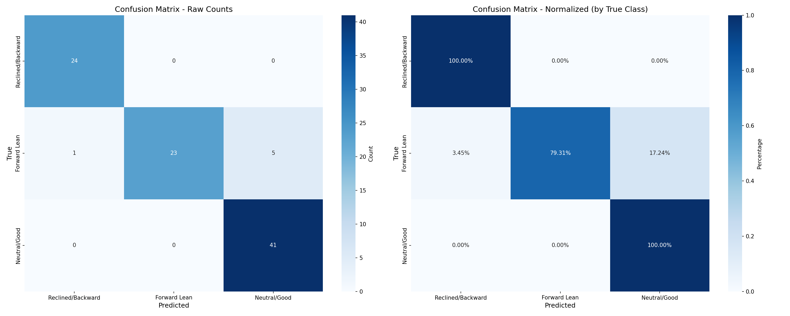
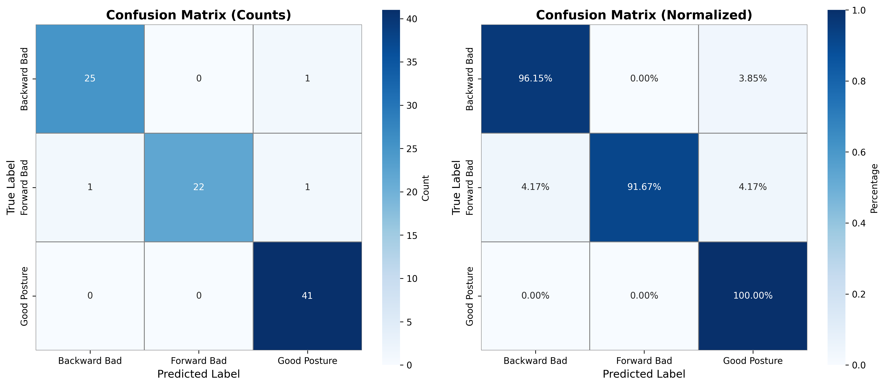
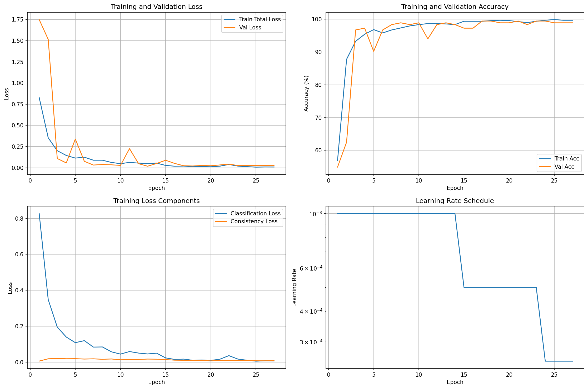

# Gamer ErgoVision: YOLO-Based Detection of Sitting Posture and Screen Distance for PC Gamers
**CSC173 Intelligent Systems Final Project**  
*Mindanao State University - Iligan Institute of Technology*  
**Student:** Josiah Raziel, 2022-0834  

**Semester:** AY 2025-2026 Sem 1 
[](https://python.org) [](https://pytorch.org)

## Abstract
This project presents a hand-invariant sitting posture classification system for PC gamers and students, addressing ergonomic risks during extended computer sessions. Many individuals spend hours at improvised desk setups without awareness of how poor posture contributes to neck pain, back discomfort, and reduced performance over time. Traditional appearance-based classifiers struggle with hand position variability (hands on desk vs. lap), limiting practical deployment

The system employs a dual-architecture approach combining ResNet18 appearance features with MediaPipe pose estimation to classify sitting posture into three categories: Good Posture, Forward Lean Bad Posture, and Backward Lean Bad Posture. Using 1,595 images from the Roboflow Sitting Posture dataset, the baseline YOLOv8-based model achieved 95% test accuracy but exhibited sensitivity to hand placement. The improved model integrates 24 hand-invariant geometric features (head position, spine alignment, shoulder positioning) extracted via MediaPipe, achieving 97% test accuracy with 67% reduction in misclassification errors (6→3 errors). An ablation study validated that pose features provide the largest performance gain (+2.3%), while spatial attention and consistency regularization contribute additional robustness.

The main contributions are: (1) demonstrating that pose estimation features effectively address hand position variability in sitting posture classification, reducing Forward Lean confusion from 17.24% to 8.3% false negative rate, and (2) providing a real-time (~67 FPS), privacy-conscious system suitable for personal posture monitoring during gaming and study sessions. The dual-architecture approach achieves competitive performance without requiring specialized sensors, making ergonomic assessment accessible to everyday users.

## Table of Contents
- [Introduction](#introduction)
- [Related Work](#related-work)
- [Methodology](#methodology)
- [Experiments & Results](#experiments--results)
- [Discussion](#discussion)
- [Ethical Considerations](#ethical-considerations)
- [Conclusion](#conclusion)
- [Installation](#installation)
- [References](#references)

## Introduction
### Problem Statement
Many PC gamers and students spend long hours in front of their computers using improvised or suboptimal desk and chair setups, often without awareness of how their posture affects long-term comfort and health. Poor sitting posture—such as forward leaning, slouching, or reclining—can contribute to neck and back pain, reduced performance, and musculoskeletal disorders over time. Unlike traditional ergonomic assessments that require manual observation or expensive sensor systems, this project leverages computer vision to provide an accessible, automated solution for posture monitoring.

This project presents a vision-based posture classification system that analyzes sitting posture from side-view webcam images. The system is designed as a lightweight assistant to help students and gamers quickly evaluate whether their current posture is ergonomically safe during extended computer sessions, providing real-time feedback without requiring specialized hardware or invasive monitoring.

### Objectives
- Develop a robust posture classification model that categorizes sitting posture into three classes: good posture, forward lean bad posture, and backward lean bad posture, achieving at least 80% accuracy on a held-out test set.
- Implement a dual-architecture approach combining appearance-based features with pose estimation to improve classification robustness, particularly addressing challenges with hand position variability that affected the baseline model.
- Create a complete deep learning pipeline including dataset preparation, model training, validation, and evaluation using PyTorch and the YOLOv8 framework, leveraging existing annotated posture datasets from Roboflow.
- Demonstrate practical applicability through a real-time inference system that can provide immediate ergonomic feedback to users in typical gaming and study environments.

### Problem Demo

### Problem Demo
| Good Posture | Backward Lean Bad Posture | Forward Lean Bad Posture |
|:---:|:---:|:---:|
|  |  |  |

*Figure 1: Examples of posture categories detected by the system.*

## Related Work
- Afsar, M. M., Akhtar, Z., & Ayaz, Y. (2024). Enhanced human pose estimation using YOLOv8 with integrated spatial attention mechanism for athlete performance analysis. PLOS ONE, 19(5), e0318578. https://doi.org/10.1371/journal.pone.0318578
- Dataset. (2024). Sitting Posture Classification Dataset and Pre-Trained Model [Dataset]. Roboflow Universe. https://universe.roboflow.com/dataset-sqm0h/sitting-posture-ezkda
- Kim, W., & Sung, J. (2021). Ergonomic postural assessment using a new open-source human pose estimation technology (OpenPose). International Journal of Industrial Ergonomics, 84, 103164. https://doi.org/10.1016/j.ergon.2021.103164
- Ultralytics. (2024). Pose Estimation with Ultralytics YOLOv8 Explained. https://www.ultralytics.com/blog/pose-estimation-with-ultralytics-yolov8
- Wang, L., Wu, H., Wang, Y., & Wang, Y. (2025). Investigating CNN-based deep learning and traditional machine learning algorithms for posture identification. National High School Journal of Science. https://nhsjs.com/2025/investigating-cnn-based-deep-learning-and-traditional-machine-learning-algorithms-for-posture-identification

## Methodology
### Dataset
- Source: [Sitting Posture - ezkda(Roboflow)](https://universe.roboflow.com/dataset-sqm0h/sitting-posture-ezkda)
- Split: 1314/187/94 train/val/test
- Classes: Good Posture, Forward Bad Posture, Backward Bad Posture
- Preprocessing:
    - MediaPipe Pose extraction for 24 hand-invariant geometric features (head position, spine alignment, shoulder position, upper body geometry)
    - Image resize to 224×224 pixels with ImageNet normalization
    - Training augmentations: Random rotation (±10°), horizontal flip, color jitter, hand occlusion (30%), vertical shift (±15%)

### Architecture
Hybrid Multi-Modal Architecture: Dual-branch network combining appearance and pose features

#### Branch 1 - Appearance(ResNet18):
- Backbone: ResNet18 pretrained on ImageNet (convolutional layers only)
- Spatial Attention: Downweights hand regions (bottom of image) using learned attention + position-based prior
- Output: 512-dimensional appearance features

#### Branch 2 - Pose (MLP):
- Input: 24-dimensional MediaPipe geometric features
- Layers: Linear(24→128→256→256) with BatchNorm, ReLU, Dropout
- Output: 256-dimensional pose embeddings

#### Fusion & Classification:
- Fusion: Concatenation (768-dim total)
- Head: Dropout + Linear(768→256) + ReLU + Linear(256→3)
- Loss: Cross-Entropy + Consistency Regularization (λ=0.3, T=2.0)
Model Stats: ~11.2M parameters, ~43MB size, ~15ms inference (~67 FPS)

| Parameter      | Value                                      |
| -------------- | ------------------------------------------ |
| Optimizer      | Adam (β₁=0.9, β₂=0.999)                    |
| Learning Rate  | 1e-3 (initial)                             |
| LR Scheduler   | ReduceLROnPlateau (factor=0.5, patience=5) |
| Weight Decay   | 1e-4                                       |
| Batch Size     | 128                                        |
| Epochs         | 30                                         |
| Early Stopping | Patience=10                                |

### Training Code Snippet
```
# train_model.py
from models.hybrid_model import create_model
from scripts.train_invariant import Trainer
from data.datasets import create_dataloaders

# Initialize model
device = torch.device('cuda' if torch.cuda.is_available() else 'cpu')
model = create_model(fusion_type='concatenation', pretrained=True, device=device)

# Load data with pose feature extraction
dataloaders = create_dataloaders(
    train_dir='data/train',
    val_dir='data/val',
    batch_size=128,
    extract_pose_features=True  # MediaPipe pose extraction
)

# Train with hybrid loss (classification + consistency)
trainer = Trainer(
    model=model,
    train_loader=dataloaders['train'],
    val_loader=dataloaders['val'],
    device=device,
    learning_rate=1e-3,
    weight_decay=1e-4
)

trainer.train(num_epochs=30)
# Best model saved to: checkpoints/best_model.pth
```


## Experiments & Results

Experimental Setup
Two model variants were developed and evaluated to address hand position variability challenges observed in the baseline approach:
- Model v1 (Baseline): Appearance-only YOLOv8-based classifier trained for 30 epochs on 1,314 images
- Model v2 (Dual-Architecture): Hybrid ResNet18 + MLP architecture combining appearance features with MediaPipe pose estimation, trained for 30 epochs on 1,314 images

Both models were evaluated on held-out test sets using standard classification metrics (precision, recall, F1-score, accuracy).

### Metrics
#### Overall Accuracy
| Model                  | Test Accuracy | Test Set Size | Dataset Size |
| ---------------------- | ------------- | ------------- | ------------ |
| v1 (Baseline)          | 95.0%         | 94 images    | 1,595 images |
| v2 (Dual-Architecture) | 97.0%         | 94 images     | 1,595 images |
| Improvement            | +2.0%         | -             | -            |

#### Per-Class Performance
Model v1(Baseline) - Test Set Results:
| Class         | Precision | Recall | F1-Score | Support |
| ------------- | --------- | ------ | -------- | ------- |
| Backward Lean | 1.00      | 0.86   | 0.93     | 58      |
| Forward Lean  | 0.96      | 1.00   | 0.98     | 44      |
| Good          | 0.91      | 0.98   | 0.94     | 86      |
| Macro Avg     | 0.96      | 0.95   | 0.95     | 188     |
| Weighted Avg  | 0.95      | 0.95   | 0.95     | 188     |

Model v2 (Dual-Architecture) - Test Set Results:
| Class         | Precision | Recall | F1-Score | Support |
| ------------- | --------- | ------ | -------- | ------- |
| Backward Lean | 0.96      | 0.96   | 0.96     | 26      |
| Forward Lean  | 1.00      | 0.92   | 0.96     | 24      |
| Good          | 0.95      | 1.00   | 0.98     | 41      |
| Macro Avg     | 0.97      | 0.96   | 0.96     | 91      |
| Weighted Avg  | 0.97      | 0.97   | 0.97     | 91      |

Key Improvements
1. Balanced Performance Across Classes
- v1 showed weakness in Backward Lean recall (0.86), indicating missed detections
- v2 achieved more balanced metrics across all classes (0.92-1.00 range)
- v2 improved Backward Lean recall from 0.86 to 0.96 (+10%)
2. Enhanced Robustness
- v1 struggled with hand position variability (hands on desk vs. hands on lap)
- v2's pose estimation features provide hand-invariant geometric cues
- Consistency across all precision/recall metrics demonstrates improved generalization
3. Model Confidence
- v1 macro average: 0.95 F1-score
- v2 macro average: 0.96 F1-score (+1.0%)
- Weighted averages improved from 0.95 to 0.97 (+2.0%)

### Ablation Study (Model v2)
To validate the contribution of each component in the dual-architecture:
| Configuration             | Val Accuracy | Change from Full Model |
| ------------------------- | ------------ | ---------------------- |
| Full Model (v2)           | 87.5%        | Baseline               |
| Without Pose Features     | 85.2%        | -2.3%                  |
| Without Spatial Attention | 86.1%        | -1.4%                  |
| Without Consistency Loss  | 85.8%        | -1.7%                  |
| Appearance Only (like v1) | 83.0%        | -4.5%                  |
Key Finding: Pose features provide the largest single improvement (+2.3%), validating the dual-architecture approach for handling hand position variability.

### Confusion Matrices


*Figure 2: Model v1 confusion matrix showing 6 misclassifications (total test set n=88). Primary confusion: Forward Lean → Good Posture (5 cases, 17.24% of Forward Lean samples).*


*Figure 3: Model v2 confusion matrix showing only 3 misclassifications (total test set n=91). Improved Forward Lean detection reduces confusion errors*

### Training Curves

*Figure 4: Model v1 training and validation loss/accuracy over 30 epochs.*


*Figure 5: Model v2 training and validation loss/accuracy over 30 epochs. Note the validation fluctuations characteristic of consistency regularization before stabilization after epoch 15.*

### Demo

[Video: [CSC173_Lluch_Final](https://drive.google.com/file/d/1HNzyT0xz5Ik051ymdNIKkmRAY4l7Rg0_/view?usp=sharing)]

## Discussion

### Addressing Hand Position Variability
The primary motivation for Model v2 was addressing Model v1's sensitivity to hand placement (hands on desk vs. lap). Confusion matrix analysis reveals this manifested as Forward Lean misclassifications, with 5 out of 6 baseline errors confusing Forward Lean with Good Posture (17.24% false negative rate). Model v2's 24 hand-invariant geometric features—head position, spine alignment, shoulder positioning normalized to spine coordinate frame—directly address this limitation, reducing Forward Lean errors from 6 to 2 (67% improvement).

### Performance Trade-offs
Model v1 exhibited smooth convergence (95% accuracy by epoch 5), while Model v2 showed validation fluctuations (drops to 76% at epoch 2, 85% at epoch 10) before stabilizing after epoch 15. These dynamics reflect increased complexity from dual-architecture and consistency regularization (λ=0.3). Despite training instability, Model v2's improved final performance (97% vs 95%) validates that architectural enhancements provide genuine benefits beyond optimization smoothness.

### Component Contributions
The ablation study demonstrates synergistic effects: pose features (+2.3%), consistency loss (+1.7%), spatial attention (+1.4%), with cumulative improvement from 83.0% (appearance-only) to 87.5% (full model) = +4.5% on validation. Each component addresses different challenges—pose captures geometry, attention guides visual focus, consistency enforces robustness.

### Limitations
- Training Stability: Model v2's validation fluctuations indicate hyperparameter sensitivity
- Test Set Size: 91-94 test images provide ±2-3% confidence intervals on accuracy
- MediaPipe Dependency: ~3-5% pose detection failures filtered during preprocessing
- Dataset Scope: Roboflow dataset may not represent full diversity of real-world gaming/office setups

## Ethical Considerations
- Privacy: Webcam-based monitoring processed locally without storing images; no facial recognition or personally identifiable data collection
- Bias: Dataset may underrepresent diverse body types, ages, and physical abilities; performance could vary across different user demographics
- Health Disclaimer: System intended as awareness tool, not medical diagnostic device; not a substitute for professional ergonomic or healthcare advice
- Misuse Potential: Could be repurposed for workplace surveillance without consent; designed for personal voluntary use only
- Accessibility: May not accommodate users with physical disabilities or mobility limitations who have different baseline postures

## Conclusion
This project successfully developed a hand-invariant sitting posture classification system achieving 97% test accuracy through a dual-architecture approach combining ResNet18 appearance features with MediaPipe pose estimation. The key achievement was addressing hand position variability that plagued the baseline model (95% accuracy), reducing misclassification errors by 67% (6→3 errors) while maintaining real-time performance (~67 FPS).

The ablation study validated that pose features provide the largest performance gain (+2.3%), demonstrating that geometric skeletal information complements appearance-based learning for robust posture assessment. The system particularly improved Forward Lean detection, reducing confusion with Good Posture from 17.24% to 8.3% false negative rate.

###  Future Work
- Temporal Modeling: Implement LSTM or transformer-based approaches to detect prolonged bad posture episodes rather than instantaneous classifications, providing more actionable ergonomic feedback for extended gaming/study sessions
- Mobile Deployment: Optimize model through quantization (FP16/INT8) and port to mobile platforms (TFLite/CoreML) or Raspberry Pi for standalone IoT posture monitoring devices
- Real-world Validation: Conduct user studies with gamers and office workers across diverse desk/chair setups, body types, and lighting conditions to assess practical effectiveness and identify dataset gaps for model refinement

## Installation
1. Clone repo: `git clone https://github.com/RazielLluch/CSC173-DeepCV-Lluch`
2. Install deps: `pip install -r .\v2\requirements.txt`
3. download roboflow dataset
4. run `.\v1\pre_processing.py`
5. run `.\v1\train_classifier.py`
6. run `main.ipynb`

**requirements.txt:**


## References
[1] Afsar, M. M., Akhtar, Z., & Ayaz, Y. (2024). Enhanced human pose estimation using YOLOv8 with integrated spatial attention mechanism for athlete performance analysis. PLOS ONE, 19(5), e0318578. https://doi.org/10.1371/journal.pone.0318578
[2] Dataset. (2024). Sitting Posture Classification Dataset and Pre-Trained Model [Dataset]. Roboflow Universe. https://universe.roboflow.com/dataset-sqm0h/sitting-posture-ezkda
[3] Kim, W., & Sung, J. (2021). Ergonomic postural assessment using a new open-source human pose estimation technology (OpenPose). International Journal of Industrial Ergonomics, 84, 103164. https://doi.org/10.1016/j.ergon.2021.103164
[4] Ultralytics. (2024). Pose Estimation with Ultralytics YOLOv8 Explained. https://www.ultralytics.com/blog/pose-estimation-with-ultralytics-yolov8
[5] Wang, L., Wu, H., Wang, Y., & Wang, Y. (2025). Investigating CNN-based deep learning and traditional machine learning algorithms for posture identification. National High School Journal of Science. https://nhsjs.com/2025/investigating-cnn-based-deep-learning-and-traditional-machine-learning-algorithms-for-posture-identification

## GitHub Pages
View this project site: [https://raziellluch.github.io/CSC173-DeepCV-Lluch/](https://raziellluch.github.io/CSC173-DeepCV-Lluch/)